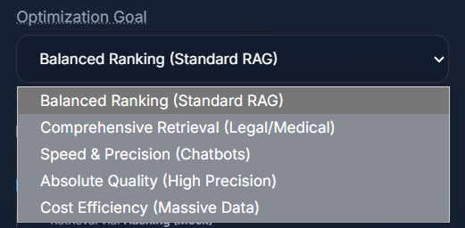

# Optimization Goals

When starting an optimization run in AutoChunks, the most important selection is the **Optimization Goal**. This defines the intent of your RAG system and mathematically guides the search engine to find the strategy that best meets that intent.

---

## Core Metric Components

Before selecting a goal, it is important to understand the three fundamental metrics that AutoChunks uses. Depending on your selected Goal, one of these will act as your **Primary Metric ($Q$)**.

### 1. Quality ($Q$) - nDCG (Ranking Excellence)
**What it measures**: Whether the correct answer is found at **Rank #1**.
*   **Formula**:

$$ \text{nDCG} = \frac{\text{DCG}}{\text{IDCG}} \text{ where } \text{DCG} = \sum_{i=1}^{p} \frac{2^{rel_i} - 1}{\log_2(i+1)} $$

---

### 2. Precision ($M$) - MRR (Search Efficiency)
**What it measures**: How quickly a user/LLM finds the first relevant piece of information.
*   **Formula**:

$$ \text{MRR} = \frac{1}{|Q|} \sum_{i=1}^{|Q|} \frac{1}{rank_i} $$

---

### 3. Coverage ($C$) - Recall (Reliability)
**What it measures**: The percentage of queries where the answer was found **anywhere** in the top results.
*   **Formula**:

$$ \text{Recall} = \frac{\text{Relevant Chunks Retrieved}}{\text{Total Relevant Chunks}} $$

---

## The Optimization Goals

We have simplified the optimization process by merging weighting logic and anchor metrics into intent-based goals.

### Balanced Ranking (Standard RAG)
**The Default.** This is the best choice for general-purpose RAG (e.g., enterprise search, documentation bots). It balances quality, precision, and cost.

*   **Primary Metric ($Q$)**: nDCG@10 (Ranking Excellence)
*   **Weights**: 60% Quality ($Q$), 20% Precision ($M$), 20% Coverage ($C$)
*   **Formula**:

$$ \text{Score} = (0.6 \cdot Q) + (0.2 \cdot M) + (0.2 \cdot C) - (0.03 \cdot \log_{10}(\text{Count})) $$

---

### Comprehensive Retrieval (Legal / Medical)
Use this when "missing an answer" is worse than "poor ranking." It prioritizes finding the answer anywhere in the context.

*   **Primary Metric ($Q$)**: Recall@50 (Answer Discovery)
*   **Weights**: 60% Quality ($Q$), 20% Precision ($M$), 20% Coverage ($C$)
*   **Formula**:

$$ \text{Score} = (0.6 \cdot Q) + (0.2 \cdot M) + (0.2 \cdot C) - (0.03 \cdot \log_{10}(\text{Count})) $$

---

### Speed & Precision (Chatbots)
Optimized for real-time conversational AI where the goal is to get the perfect answer at **Rank #1** to minimize LLM reading time and latency.

*   **Primary Metric ($Q$)**: MRR@10 (First-Hit Precision)
*   **Weights**: 80% Precision ($M$), 20% Quality ($Q$)
*   **Formula**:

$$ \text{Score} = (0.8 \cdot M) + (0.2 \cdot Q) $$

---

### Absolute Quality (Highest Precision)
Ignores infrastructure costs and index size to find the strategy that yields the single highest mathematical accuracy.

*   **Primary Metric ($Q$)**: nDCG@10 (Ranking Excellence)
*   **Weights**: 90% Quality ($Q$), 10% Precision ($M$)
*   **Formula**:

$$ \text{Score} = (0.9 \cdot Q) + (0.1 \cdot M) $$

---

### Cost Efficiency (Massive Data)
Focuses on minimizing total chunk count (storage and inference costs) while maintaining a baseline of retrieval quality.

*   **Primary Metric ($Q$)**: nDCG@10 (Ranking Excellence)
*   **Weights**: 40% Quality ($Q$), 60% Efficiency
*   **Formula**:

$$ \text{Score} = (0.4 \cdot Q) + \left( 0.6 \cdot \frac{1}{1 + 0.2 \cdot \log_{10}(\text{Count})} \right) $$

---

## Analysis Depth (Optimization Mode)

While the **Goal** defines *what* to optimize, the **Mode** defines *how hard* to search:

*   **Light (Fast Sample Sweep)**: Optimized for development. Uses a smaller document sample to find the "ballpark" winning strategy in seconds.
*   **Full (Exhaustive Corpus Audit)**: Production-grade tuning. Uses a wider document sample for high-confidence metrics and fine-grained benchmarking.

---

**Next Steps**: Once the goal is set and the run completes, you can analyze the specific retrieval stats in the [**Evaluation Engine**](evaluation.md).
