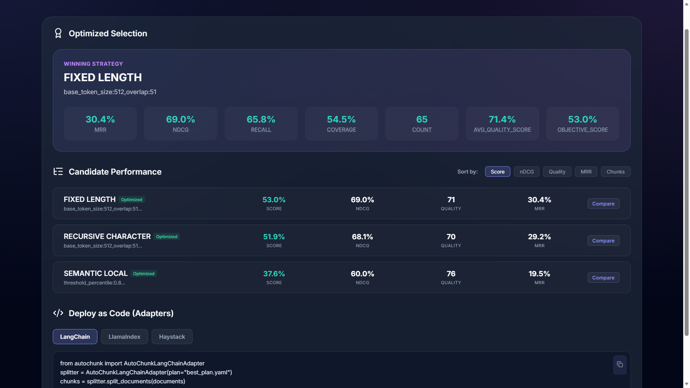

# Getting Started

This guide will help you set up AutoChunks and run your first optimization.

## Prerequisites

*   Python 3.9+
*   (Optional) NVIDIA GPU for accelerated semantic embeddings (CUDA).

## Installation

1.  **Standard Installation** (CPU-compatible):
    ```bash
    pip install -r requirements.txt
    ```

2.  **Enable GPU Acceleration (Recommended)**:
    If you plan to use Local Embeddings or Local RAGAS Evaluation, it is highly recommended to install the CUDA-enabled version of PyTorch. Without this, local models will run limited by CPU throughput.

    *   **Uninstall current torch:**
        ```bash
        pip uninstall torch torchvision torchaudio
        ```
    *   **Install CUDA 12.x version:**
        ```bash
        pip install torch torchvision torchaudio --index-url https://download.pytorch.org/whl/cu124
        ```
    *(Check your CUDA version with `nvidia-smi` and adjust `cu124` to your installed version if needed).*

### When do I need GPU support?

*   **Local Embeddings**: Required if you select "Local" in the dashboard. This runs the embedding model (like BGE or BERT) locally on your hardware.
*   **OpenAI and Ollama**: Cloud or API-based providers offload the compute, so a local GPU is not required for the Python process itself. API keys can be provided directly in the dashboard or via the `OPENAI_API_KEY` environment variable.
*   **Local RAGAS**: If you use a local Chat Model for RAGAS evaluation, a GPU is essential for acceptable performance.

## Your First Optimization

### 1. Prepare Your Data
Create a folder named `documents` and drop a few representative PDF, Markdown, or Text files into it.

```text
documents/
├── protocol_v1.pdf
├── quarterly_report.md
└── legacy_notes.txt
```

### 2. Run the Optimizer (CLI)
Execute the `optimize` command. Using `--mode light` (Light Optimization) initializes a fast sweep by sampling a specific subset of documents to find a winning strategy quickly.

```bash
autochunks optimize --docs ./documents --mode light
```

**Understanding the Optimization Pipeline**

1.  **Ingestion & High-Fidelity Extraction**: AutoChunks performs layout analysis using structural extraction (preserving headers, meta-tags, and tables). Documents are cached via SHA-256 fingerprints to bypass extraction on subsequent runs.
2.  **Adversarial Synthetic QA**: The system generates Ground Truth pairs designed to break low-quality chunkers.
    *   **Deterministic Heuristics (Default)**: Leverages sentence boundary analysis to create strict "needle-in-a-haystack" retrieval targets.
    *   **Semantic Synthesis (Optional)**: Employs LLMs to generate nuanced, paraphrased queries (see the [Configuration Guide](guides/configuration.md)).
3.  **Vectorized Tournament**: The engine fanned out across multiple strategy variations (Semantic, Recursive, Layout-aware).
4.  **Retrieval Simulation**: Every candidate is evaluated in a batch-encoded index, simulating production search across multiple metrics including nDCG and MRR.
5.  **Plan Selection**: A multi-objective weighted scorer selects the Optimal Plan based on your selected Optimization Goal.



### 3. Launch the Dashboard
For a visual breakdown of why a certain strategy was selected, launch the dashboard:

```bash
autochunks serve
```
Navigate to `http://localhost:8000` in your browser.

## Using the Result
Once you have a `best_plan.yaml`, you can use it in your code to process new documents with the exact same optimal settings.

```python
from autochunk import AutoChunker, Plan

# Load the winning strategy
plan = Plan.read("best_plan.yaml")

# Initialize chunker
chunker = AutoChunker(
    embedding_provider=plan.embedding.get("name"),
    embedding_model_or_path=plan.embedding.get("model")
)

# Apply to new documents
chunks = plan.apply("./new_data", chunker)
print(f"Created {len(chunks)} optimized chunks.")
```
