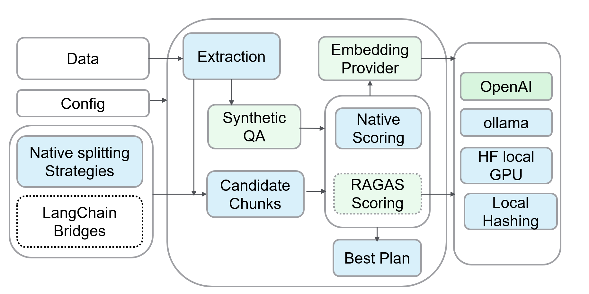

# Welcome to AutoChunks

**AutoChunks** is an advanced **Autonomous Retrieval Optimization** engine. It eliminates the guesswork in preprocessing by empirically searching for the optimal chunking strategy for your specific documents.



---

## Why AutoChunks?

Traditional RAG pipelines rely on arbitrary heuristics (e.g., *"Chunk size 512, overlap 50"*). This often leads to:  

*   **Context Fragmentation**: Splitting related information across chunks.
*   **Retrieval Noise**: Retrieving irrelevant context that pollutes the LLM prompt.
*   **Low Recall**: Missing critical answers hidden in "dead zones" between chunks.

**AutoChunks solves this by treating chunking as an optimization problem.** It runs a parallel tournament of strategies—ranging from simple Fixed Length to advanced Semantic and Hybrid approaches—and selects the winner based on **real retrieval performance** (nDCG, MRR) against a synthetic ground truth.

For a detailed look at how this approach compares to broader pipeline optimizers, see our [**AutoChunks vs. AutoRAG Comparison**](comparison_autorag.md).

## Key Features

*   **Synthetic Evaluation Engine**: Generates strict, adversarial ground-truth QA datasets (Golden Sets) from your documents. See [**Synthetic Ground Truth**](core_concepts/ground_truth.md) for details.
*   **Autonomous Optimization**: Employs multi-objective Bayesian-inspired grid searches over hyperparameters (Token Size, Overlap, Semantic Thresholds) to converge on the mathematical optimum for your specific corpus.
*   **Framework Cross-Benchmarking**: Native "Bridge" support for **LangChain**, **LlamaIndex**, and **Haystack**. Directly pit AutoChunks against industry standards to validate performance gains objectively.
*   **Advanced Semantic Strategies**: Implements industry-leading chunking algorithms including **Windowed Semantic Gradient Shift** and **Hybrid Statistical-Semantic** boundary detection.
*   **Fidelity Inspector**: A side-by-side visual debugging interface to analyze how different strategies fragment complex documents, enabling rapid qualitative verification.
*   **Enterprise-Grade Security**: Air-gap friendly by design. Supports local model paths, SHA-256 binary fingerprinting for data privacy, and a strict "Trusted Org" whitelist for all model downloads.
*   **Vectorized Search Pipeline**: Powered by a NumPy-accelerated evaluation engine. Automates thousands of retrieval simulations in seconds through batch-encoded matrix operations.
*   **Embedding Model Validation**: AutoChunks is model-agnostic. Use it to **AB Test your Embeddings** (e.g., BGE vs. BERT vs. OpenAI) to empirically determine which vector space best captures the semantic topology of *your* specific documents.

## Installation

```bash
pip install autochunks
```

## Quick Start

Optimize a folder of documents and save the best strategy:

```bash
autochunks optimize --docs ./my_docs --mode light --out best_plan.yaml
```

Launch the interactive dashboard:

```bash
autochunks serve
```

---

## Next Steps

*   [**Getting Started**](getting_started.md): Run your first optimization in 5 minutes.
*   [**Dashboard Guide**](guides/dashboard_walkthrough.md): Learn to use the visual optimization tools.
*   [**The Optimization Lifecycle**](core_concepts/eval_flow.md): Deep dive into the "Heart" of the AutoChunks search engine.
*   [**Synthetic Ground Truth**](core_concepts/ground_truth.md): How we create benchmarks from your documents.
*   [**Optimization Goals**](core_concepts/objectives.md): Configuring the engine for your specific RAG goals.
*   [**Evaluation Engine**](core_concepts/evaluation.md): How to interpret optimization results.
*   [**Chunking Strategies**](core_concepts/strategies.md): Understand the science behind the chunkers.
*   [**RAGAS Evaluation**](guides/ragas_evaluation.md): Enable LLM-based semantic assessment.
